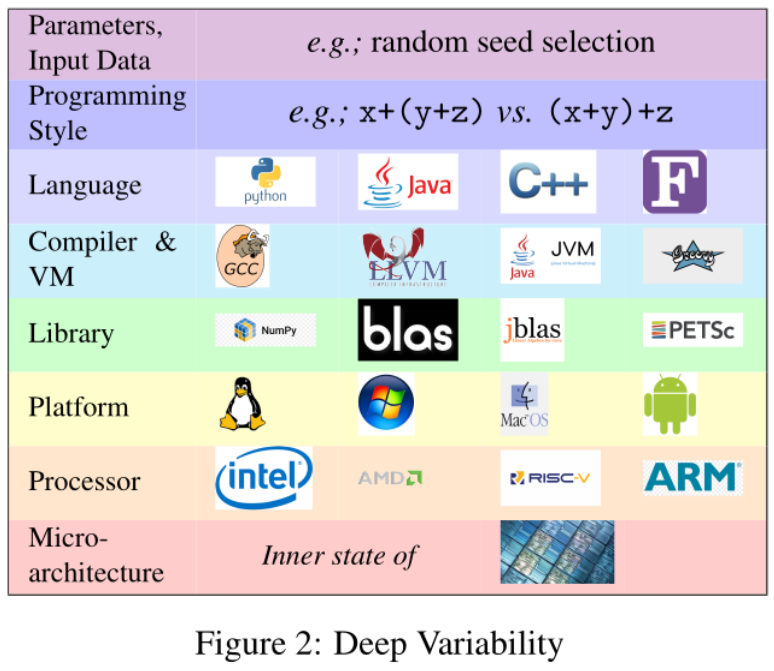

# Experiment : Sorting arrays

## Motivation

In this part, suppose you intend to reproduce a research paper whose contribution is a new approach to software engineering.
In their evaluation, the authors compare this new approach to other state-of-the-art (SOTA) approaches, stating : "we empirically evaluate that this approach consumes 20% less energy than the current SOTA approaches".
In the end, after following their protocol and computing your own results, you expect to retrieve similar conclusions during the evaluation.
 
But if the evaluation involves the measurement of a performance metric, like the energy consumption in this case, the computation of this metric can be sensitive to experimental choices and is not necessarily deterministic.
Two launches of the same experiment (even averaged) can give two different results. 

If you find a 18% gain of energy (instead of the original 20%), one could consider that the experiment is indeed reproduced.
But what about a frank difference between your results and theirs - let's say a difference of ten points, or worse, a difference so big like more than 20 points, implying that the proposed approach actually consumes more than the SOTA's? 
Who owns the truth; you, the original authors, no one or both?

Even if you carefully followed the experimental protocol proposed by the authors, at some point you probably filled in the missing information when it was not provided, trying to leave as few changes as possible compared to the original work, but still changing some hidden elements of the environment.
Some changes are listed in the following figure, and could be located in different layers of the executing environment (operating system or hardware platforms used, language chosen, etc.).



## Goal

**This directory contains a minimal prototype of experiment showing how the sensitivity of the execution environment can threaten the reproducibility of a research work** i.e. how changing the different elements of the environment can affect the final conclusions of the experiment.

## Content

In practice, it is a simple experience comparing the execution time of three simple sorting algorithms, namely BubbleSort, MergeSort and QuickSort.

### Task

Although they have different complexities, all these algorithms perform the same simple task defined as follows:

```
Given an array 
(e.g. [5,1,3,4,2]), 
the algorithm is supposed to return an array 
with the same elements, 
but ordered in an increasing manner 
(e.g. [1,2,3,4,5])
```

### Environment changes

The tricky part is that we artificially create multiple points of variability, by launching it with different setups of environments.

Following the order of the figure 2 (see above), we vary:
- [Protocol] the number of repetitions, e.g. 1, 5, 10 repetitions
- [Input Data] is the array already sorted e.g. best case vs worst case
- [Input Data] the length of the input array e.g. 10, 100, 1k, 10k, 1M elements
- [Input Data] the type of elements e.g. float or int
- [Language] the language used to implement the three algorithms, e.g. C, python, java,
- [Library] the version of docker
- [Platform] the operating system used
- [Processor] the model of hardware


